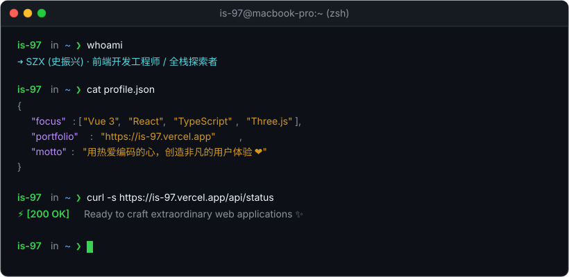

  <!-- 终端风格头部 Banner (参考 byJoey 极客黑客风格) -->
  

   

  <!-- 动态打字机效果 -->
  

   

  <!-- 极客暗黑风徽章导航栏 (byJoey 同款设计配色) -->
  
  &nbsp;
  
  &nbsp;
  
  &nbsp;
  

 

---

### 👨‍💻 关于我 / About Me

> **"Code is like humor. When you have to explain it, it's bad."**

一名热衷于创造极致交互体验的前端工程师与全栈探索者。注重工程规范、性能优化与视觉表现力，享受用代码将创意变为现实的过程。

- 🚀 **专注领域**：现代前端生态（Vue 3 / React 19）、TypeScript、Web 性能工程化
- 🎨 **图形与交互**：Three.js 3D 场景交互、GSAP 丝滑动画动效
- ☁️ **Serverless & 边缘计算**：Cloudflare Workers / Pages、D1 / KV 存储、自动化 CI/CD 流水线
- 💡 **持续精进**：全栈架构、AI Agent 智能体协同开发、跨平台应用探索

 

---

### 🛠️ 技术栈 / Tech Stack

  
   
  

 

---

### 🚀 精选项目 / Featured Projects

| 项目名称 | 描述 | 技术栈 | 链接 |
| :--- | :--- | :--- | :--- |
| 🌐 **szx-portfolio** | 个人 3D 交互作品集，融合沉浸式 Three.js 视觉与丝滑动效 | Vue 3 · Three.js · GSAP · Vite | [预览体验](https://is-97.vercel.app/) |
| 📬 **cloudflare_temp_email** | 基于 Cloudflare 生态的高性能免费临时邮箱系统，支持邮件路由与全自动同步 | Workers · D1 · Pages · GitHub Actions | [查看仓库](https://github.com/is-97/cloudflare_temp_email) |
| ⚡ **edgetunnel** | 基于 Cloudflare 边缘计算平台的高性能网络代理与通信隧道服务 | Cloudflare Pages · VLESS · Edge Runtime | [查看仓库](https://github.com/is-97/edgetunnel) |
| 💌 **notify-server** | 每日早安与情话智能推送机器人，集成大模型内容生成与天气提醒 | Node.js · TypeScript · 企业微信 · 大模型 API | [查看仓库](https://github.com/is-97/notify-server) |

 

---

### 📊 GitHub 统计 / Activity Stats

  <!-- GitHub Stats 卡片 (匹配 GitHub 深色主题 #0d1117) -->
  
  &nbsp;
  <!-- 最常使用语言卡片 -->
  

   
   

  <!-- 连击 Streak 统计卡片 -->
  

 

---

  用热爱编码的心，创造非凡的价值 ❤️ · Crafting the future one commit at a time

